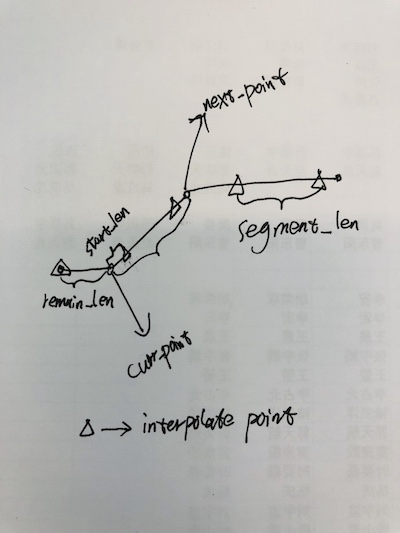
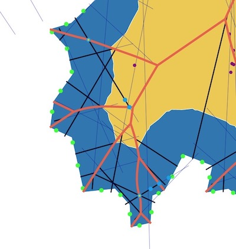
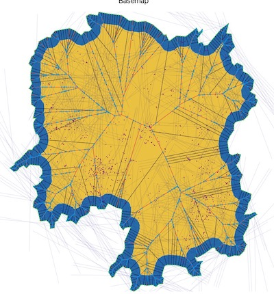
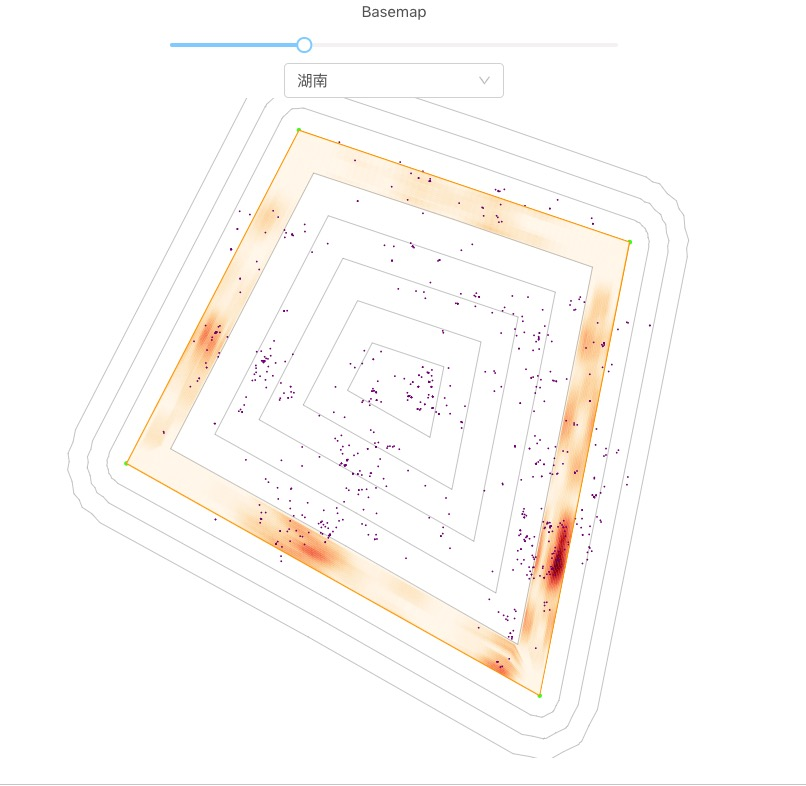
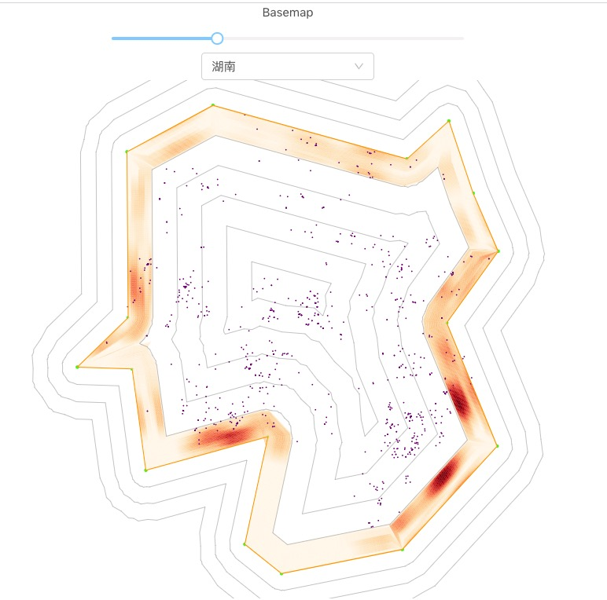
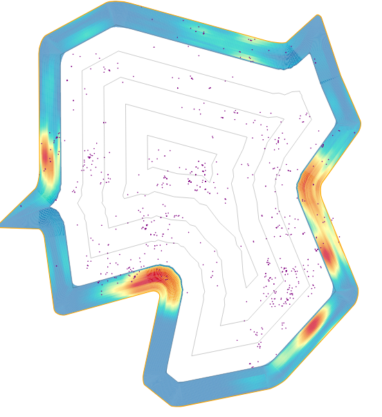

This project was bootstrapped with [Create React App](https://github.com/facebook/create-react-app).

### Intro
From data to csv
Boundary data: 
geojson (array) —>
smooth outline with array (library: [https://github.com/RobinCK/smooth-polyline](https://github.com/RobinCK/smooth-polyline)) —> 
offset boundary with the array (library: [https://github.com/w8r/polygon-offset](https://github.com/w8r/polygon-offset)) —>
medial axis computation ⭐([https://github.com/FlorisSteenkamp/MAT](https://github.com/FlorisSteenkamp/MAT)) —>
segmentation 

### Sites data:
Map dots to the map (作为参照) —> 
Given a segmentation, map dot density —> color range 
computes all segments —> color ranges 

### Code: 
1. react or not?  Using lots of npm package;
2. ⭐ problem of using an library:  1. Data input;   2. 等距两点 —> 画出最大内切圆 —> 内切圆点的集合 == medial axis      

### Step:
1. Start from Zhejiang province, mapping Zhejiang boundary + dots (example: [http://ssz.fr/places/?eu#ac$//] (http://ssz.fr/places/?eu#ac$//)) . ✅
2. Smooth outline + offset outline ✅
3. Medial axis + segmentation ❌   (Problem: Can not segment the region correctly because there's too many branch; Can not find all intersection points, which may due to: findMinDistance issue, or path-intersection issue).
4. Mapping density —> color ✅ （Need to refine and aggregate them into a pure function)

### Schedule for December:
1. Finish the boundary segmentation function, sub-segment counting function and color projection function, by December 28th.
2. Look into Medial Axis source code, and understand how [a point on medial axis] and [a point on the edge] matches.
3. Junhan will help on segmentation computation, therefore, we can make sure to have an output whatever which region segmentation algorithm to use.
4. Compare medial axis computation result with Junhan's maximum intersect circle.
5. Guojun will look at "region with multiple center" implementation.

### Schedule for Februrary:
1. Fine tune sliding window algorithm for color mapping; 
2. Cope with sharp corners within the polygon for better segmentation;
3. Prepare samples for human subject study, including: 3 samples for training; 4 complex boundary for matching task; one adjacent boundaries sample for demonstration.

## Algorithm about
0. Data processign with Shapely and geoPandas in Python, also maptool online for adjacent boundary simplification.

1. Interpolate point on path evenly:

2. test two weird vertical paths, get nearest points with paper successfully

3. Done: Medial axis + segmentation

4. Count points: https://github.com/substack/point-in-polygon

5. Polygon clipping/ intersection, based on A new algorithm for computing bollean operations on polugons: https://github.com/mfogel/polygon-clipping/blob/master/paper.pdf
Implementation: 
https://github.com/mfogel/polygon-clipping

6. Simplify boundary: https://mourner.github.io/simplify-js/  

7. Encode density information to contour area of a arbitrary polygon  
Simple shape example:   
Complex shape example:   
Enlarge color scope for : 
